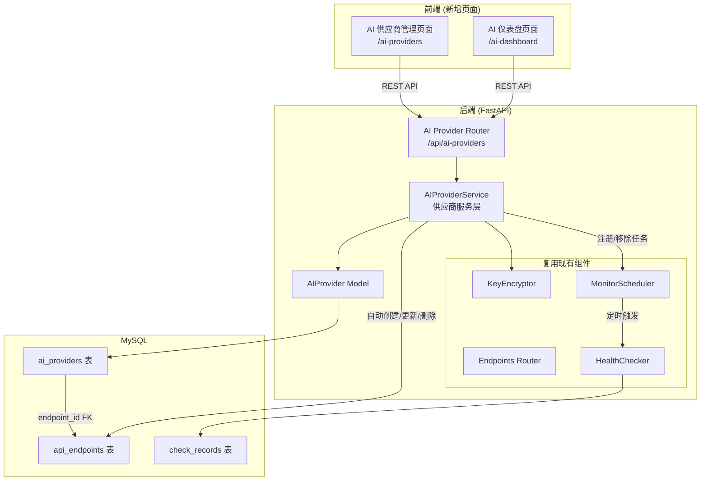
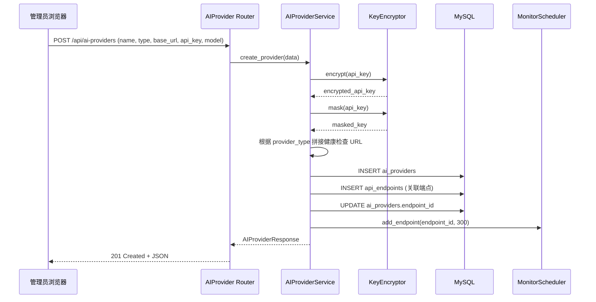
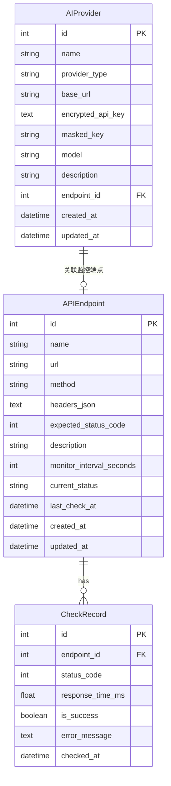

# 技术设计文档：AI 供应商管理模块

## 概述

AI 供应商管理模块是现有 API 监控管理系统的扩展功能，用于集中管理 AI 服务商（OpenAI、Claude、Azure OpenAI 等）的配置信息，并自动创建对应的监控端点以实现健康探测。模块包含：

- **后端**：新增 AIProvider 数据模型、CRUD API 路由（`/api/ai-providers`）、供应商服务层（自动创建/同步/删除关联 API_Endpoint）、AI 仪表盘聚合 API（`/api/ai-providers/dashboard`）
- **前端**：新增两个页面——AI 仪表盘（`/ai-dashboard`）和 AI 供应商管理（`/ai-providers`）

模块复用现有的 KeyEncryptor（Fernet 加密）、MonitorScheduler（调度器）、HealthChecker（健康检查器）等服务组件，与现有系统无缝集成。

## 架构

### 模块架构图



### 请求流程：创建 AI 供应商



### 健康检查 URL 映射逻辑

根据 `provider_type` 和 `base_url` 拼接健康检查 URL：

| provider_type | 健康检查路径 | 示例 |
|---|---|---|
| openai | `/v1/models` | `https://api.openai.com/v1/models` |
| claude_code | `/v1/models` | `https://api.anthropic.com/v1/models` |
| azure_openai | `/openai/models?api-version=2024-02-01` | `https://xxx.openai.azure.com/openai/models?api-version=2024-02-01` |
| custom | 直接使用 `base_url` | `https://my-ai.example.com/health` |

对于 `claude_code` 类型，请求头使用 `x-api-key` 而非 `Authorization: Bearer`。

## 组件与接口

### 后端 API 路由设计

#### AI 供应商管理模块 (`/api/ai-providers`)

| 方法 | 路径 | 说明 | 认证 |
|---|---|---|---|
| GET | `/api/ai-providers` | 获取所有 AI 供应商列表（api_key 脱敏） | 是 |
| POST | `/api/ai-providers` | 创建新 AI 供应商（自动创建关联端点） | 是 |
| GET | `/api/ai-providers/{id}` | 获取单个 AI 供应商详情 | 是 |
| PUT | `/api/ai-providers/{id}` | 更新 AI 供应商配置（同步更新关联端点） | 是 |
| DELETE | `/api/ai-providers/{id}` | 删除 AI 供应商（级联删除关联端点） | 是 |

#### AI 仪表盘 API (`/api/ai-providers/dashboard`)

| 方法 | 路径 | 说明 | 认证 |
|---|---|---|---|
| GET | `/api/ai-providers/dashboard/summary` | 获取 AI 供应商汇总统计 | 是 |
| GET | `/api/ai-providers/dashboard/response-trend` | 获取最近 24h 响应时间趋势数据 | 是 |
| GET | `/api/ai-providers/dashboard/availability` | 获取最近 24h 可用性时间线数据 | 是 |

### 核心服务组件

#### AIProviderService（供应商服务层）

负责 AI 供应商的业务逻辑处理，包括 CRUD 操作和自动管理关联的 API_Endpoint。

```python
class AIProviderService:
    def __init__(self, db: AsyncSession):
        self.db = db

    async def list_providers(self) -> List[AIProvider]:
        """返回所有 AI 供应商列表"""

    async def get_provider(self, provider_id: int) -> AIProvider:
        """获取单个 AI 供应商，不存在则抛出 404"""

    async def create_provider(self, data: AIProviderCreate) -> AIProvider:
        """创建 AI 供应商并自动创建关联的 API_Endpoint
        1. 加密 api_key，生成 masked_key
        2. 根据 provider_type + base_url 拼接健康检查 URL
        3. 创建 API_Endpoint（名称格式: [AI] {name}）
        4. 注册到 MonitorScheduler
        5. 保存 endpoint_id 到 AIProvider
        """

    async def update_provider(self, provider_id: int, data: AIProviderUpdate) -> AIProvider:
        """更新 AI 供应商配置
        - 若 api_key 未提供，保留原有加密密钥
        - 若 base_url 或 api_key 变更，同步更新关联 API_Endpoint
        """

    async def delete_provider(self, provider_id: int) -> None:
        """删除 AI 供应商及其关联的 API_Endpoint（级联删除监控数据）"""

    def build_health_url(self, provider_type: str, base_url: str) -> str:
        """根据 provider_type 拼接健康检查 URL"""

    def build_headers(self, provider_type: str, decrypted_key: str) -> str:
        """根据 provider_type 构建请求头 JSON 字符串"""
```

#### 仪表盘聚合查询

```python
async def get_dashboard_summary(self) -> DashboardSummary:
    """汇总统计：总数、正常/异常/未知数量、健康率"""

async def get_response_trend(self, provider_type: Optional[str] = None) -> List[ProviderTrend]:
    """最近 24h 各供应商响应时间趋势（按小时聚合）"""

async def get_availability_timeline(self, provider_type: Optional[str] = None) -> List[ProviderAvailability]:
    """最近 24h 各供应商可用性时间线"""
```

### Pydantic Schema 设计

```python
# --- 请求 Schema ---
class AIProviderCreate(BaseModel):
    name: str
    provider_type: str  # openai | claude_code | azure_openai | custom
    base_url: str       # 必须以 http:// 或 https:// 开头
    api_key: str
    model: str
    description: Optional[str] = None

class AIProviderUpdate(BaseModel):
    name: Optional[str] = None
    provider_type: Optional[str] = None
    base_url: Optional[str] = None
    api_key: Optional[str] = None  # 不提供则保留原值
    model: Optional[str] = None
    description: Optional[str] = None

# --- 响应 Schema ---
class AIProviderResponse(BaseModel):
    id: int
    name: str
    provider_type: str
    base_url: str
    masked_key: str
    model: str
    description: Optional[str]
    endpoint_id: Optional[int]
    current_status: Optional[str]      # 来自关联 endpoint
    last_check_at: Optional[datetime]  # 来自关联 endpoint
    created_at: datetime
    updated_at: datetime

# --- 仪表盘 Schema ---
class DashboardSummary(BaseModel):
    total: int
    healthy: int
    unhealthy: int
    unknown: int
    health_rate: float

class TrendPoint(BaseModel):
    timestamp: str       # ISO 格式小时时间戳
    response_time_ms: Optional[float]

class ProviderTrend(BaseModel):
    provider_id: int
    provider_name: str
    provider_type: str
    data_points: List[TrendPoint]

class AvailabilitySlot(BaseModel):
    timestamp: str
    status: str  # normal | abnormal | no_data

class ProviderAvailability(BaseModel):
    provider_id: int
    provider_name: str
    provider_type: str
    slots: List[AvailabilitySlot]
```

### 前端页面结构

| 页面 | 路由 | 说明 |
|---|---|---|
| AI 仪表盘 | `/ai-dashboard` | AI 供应商实时状态概览、响应时间趋势、可用性时间线 |
| AI 供应商管理 | `/ai-providers` | AI 供应商 CRUD 管理 |

#### AI 仪表盘页面组件

```
┌─────────────────────────────────────────────────────────┐
│ AI 仪表盘                          [类型筛选器 ▼]       │
├─────────────────────────────────────────────────────────┤
│ ┌──────┐ ┌──────┐ ┌──────┐ ┌──────┐ ┌──────────┐      │
│ │ 总数 │ │ 正常 │ │ 异常 │ │ 未知 │ │ 健康率 % │      │
│ └──────┘ └──────┘ └──────┘ └──────┘ └──────────┘      │
├─────────────────────────────────────────────────────────┤
│ OpenAI 组                                               │
│ ┌──────────┐ ┌──────────┐                               │
│ │ GPT-4    │ │ GPT-3.5  │                               │
│ │ ● 正常   │ │ ● 异常   │                               │
│ │ 120ms    │ │ --       │                               │
│ └──────────┘ └──────────┘                               │
│ Claude 组                                               │
│ ┌──────────┐                                            │
│ │ Claude3  │                                            │
│ │ ● 正常   │                                            │
│ │ 200ms    │                                            │
│ └──────────┘                                            │
├─────────────────────────────────────────────────────────┤
│ 响应时间趋势（最近 24h）                                │
│ ┌─────────────────────────────────────────────────┐     │
│ │  折线图 (Chart.js) - 每个供应商一条线            │     │
│ └─────────────────────────────────────────────────┘     │
├─────────────────────────────────────────────────────────┤
│ 可用性时间线（最近 24h）                                │
│ ┌─────────────────────────────────────────────────┐     │
│ │  水平条形图 - 绿色=正常 红色=异常 灰色=无数据    │     │
│ └─────────────────────────────────────────────────┘     │
└─────────────────────────────────────────────────────────┘
```

#### AI 供应商管理页面组件

```
┌─────────────────────────────────────────────────────────┐
│ AI 供应商管理                     [添加供应商] 按钮      │
├─────────────────────────────────────────────────────────┤
│ 表格：名称 | 类型 | 模型 | 基础地址 | API Key | 状态   │
│        | 最近检查 | 操作(编辑/删除)                      │
├─────────────────────────────────────────────────────────┤
│ 模态表单（添加/编辑）：                                  │
│   名称、供应商类型(下拉)、基础地址、API Key、模型、备注  │
└─────────────────────────────────────────────────────────┘
```

## 数据模型

### ER 关系图（新增部分）



### ai_providers 表

| 字段 | 类型 | 约束 | 说明 |
|---|---|---|---|
| id | INT | PK, AUTO_INCREMENT | 主键 |
| name | VARCHAR(100) | NOT NULL | 供应商名称 |
| provider_type | VARCHAR(30) | NOT NULL | 类型：openai/claude_code/azure_openai/custom |
| base_url | VARCHAR(500) | NOT NULL | 基础地址 |
| encrypted_api_key | TEXT | NOT NULL | Fernet 加密后的 API Key |
| masked_key | VARCHAR(30) | NOT NULL | 脱敏显示值 |
| model | VARCHAR(100) | NOT NULL | 模型名称 |
| description | VARCHAR(500) | NULLABLE | 备注 |
| endpoint_id | INT | FK, NULLABLE, UNIQUE | 关联的 API_Endpoint ID |
| created_at | DATETIME | NOT NULL | 创建时间 |
| updated_at | DATETIME | NOT NULL | 更新时间 |

外键约束：`endpoint_id REFERENCES api_endpoints(id) ON DELETE SET NULL`


## 正确性属性（Correctness Properties）

*属性（Property）是指在系统所有有效执行中都应成立的特征或行为——本质上是对系统应做什么的形式化陈述。属性是人类可读规格说明与机器可验证正确性保证之间的桥梁。*

### Property 1: API Key 加密解密往返一致性

*For any* 有效的 API Key 字符串，使用 KeyEncryptor 加密后再解密，应得到与原始值完全相同的字符串。

**Validates: Requirements 1.3**

### Property 2: API Key 脱敏保留部分可见字符

*For any* API Key 字符串（长度 ≥ 1），经过 KeyEncryptor.mask() 处理后，输出应包含 `****` 掩码部分，且输出长度小于原始长度（当原始长度 > 8 时），同时保留的可见字符应与原始字符串的对应位置字符一致。

**Validates: Requirements 1.4**

### Property 3: 输入校验正确拒绝无效数据

*For any* 提交的 AI 供应商创建请求，若缺少任一必填字段（name、provider_type、base_url、api_key、model）或 base_url 不以 `http://` 或 `https://` 开头，则校验应失败并返回错误；若所有必填字段齐全且 base_url 格式正确，则校验应通过。

**Validates: Requirements 1.1, 1.6**

### Property 4: 更新时未提供 api_key 则保留原值

*For any* 已存在的 AI 供应商，当执行更新操作且请求体中未包含 api_key 字段时，更新后的 encrypted_api_key 和 masked_key 应与更新前完全一致。

**Validates: Requirements 2.8**

### Property 5: 健康检查 URL 映射正确性

*For any* 有效的 (provider_type, base_url) 组合，`build_health_url` 函数应返回符合映射规则的 URL：openai 类型追加 `/v1/models`，claude_code 类型追加 `/v1/models`，azure_openai 类型追加 `/openai/models?api-version=2024-02-01`，custom 类型直接返回 base_url。且返回的 URL 应始终以 `http://` 或 `https://` 开头。

**Validates: Requirements 4.2**

### Property 6: 请求头按供应商类型正确构建

*For any* 有效的 (provider_type, decrypted_api_key) 组合，`build_headers` 函数应返回包含正确认证头的 JSON 字符串：openai 和 azure_openai 类型使用 `Authorization: Bearer {key}`，claude_code 类型使用 `x-api-key: {key}`，custom 类型使用 `Authorization: Bearer {key}`。

**Validates: Requirements 4.3**

### Property 7: 创建供应商自动生成正确配置的监控端点

*For any* 有效的 AI 供应商创建请求，创建成功后应同时存在一个关联的 API_Endpoint，该端点的名称格式为 `[AI] {provider_name}`，URL 符合 Property 5 的映射规则，监控频率为 300 秒，且 AI_Provider 的 endpoint_id 指向该端点。

**Validates: Requirements 4.1, 4.4, 4.5, 4.8**

### Property 8: 更新供应商同步更新关联端点

*For any* 已存在的 AI 供应商，当更新其 base_url 或 api_key 时，关联的 API_Endpoint 的 URL 和 headers_json 应同步更新为新值对应的正确配置。

**Validates: Requirements 4.6**

### Property 9: 删除供应商级联删除关联端点

*For any* 已存在的 AI 供应商，删除该供应商后，其关联的 API_Endpoint 应同时被删除，且该端点的所有 CheckRecord 也应被级联删除。

**Validates: Requirements 4.7**

### Property 10: 仪表盘汇总统计正确性

*For any* AI 供应商集合，仪表盘汇总 API 返回的 total 应等于供应商总数，healthy + unhealthy + unknown 应等于 total，health_rate 应等于 healthy / total（total 为 0 时 health_rate 为 0）。

**Validates: Requirements 6.2**

### Property 11: 供应商按类型分组与筛选正确性

*For any* AI 供应商集合和任意类型筛选条件，按类型分组后每组内的所有供应商的 provider_type 应一致，且当应用类型筛选时，结果应仅包含匹配该类型的供应商，"全部"筛选应返回所有供应商。

**Validates: Requirements 6.4, 6.9**

## 错误处理

### 后端错误处理

| 场景 | HTTP 状态码 | 错误信息 |
|---|---|---|
| 未认证访问 | 401 | Unauthorized |
| AI 供应商不存在 | 404 | AI Provider not found |
| base_url 格式无效 | 422 | URL must start with http:// or https:// |
| 必填字段缺失 | 422 | Field required |
| provider_type 不在允许范围 | 422 | Invalid provider type |
| 关联端点创建失败 | 500 | Failed to create associated endpoint |
| 数据库操作失败 | 500 | Internal server error |

### 前端错误处理

- API 请求失败时显示错误提示信息
- 401 响应自动跳转到登录页
- 表单提交前进行客户端校验（必填字段、URL 格式）
- 网络异常时显示连接错误提示
- 仪表盘数据加载失败时显示"数据加载失败"占位

## 测试策略

### 单元测试

使用 `pytest` + `pytest-asyncio` 进行后端单元测试：

- **AIProviderService 测试**：
  - `build_health_url()` 各类型映射正确性
  - `build_headers()` 各类型请求头构建
  - 创建供应商时自动创建端点的完整流程
  - 更新供应商时同步更新端点
  - 删除供应商时级联删除端点
  - 更新时不提供 api_key 保留原值

- **Schema 校验测试**：
  - AIProviderCreate 必填字段校验
  - base_url 格式校验
  - AIProviderUpdate 可选字段处理

- **API 路由测试**：
  - CRUD 各接口的正常流程
  - 认证保护（401）
  - 资源不存在（404）
  - 仪表盘聚合 API 数据正确性

### 属性测试（Property-Based Testing）

使用 `hypothesis` 库进行属性测试，每个属性至少运行 100 次迭代：

- **Property 1**: API Key 加密解密往返
  - Tag: `Feature: ai-provider-management, Property 1: API Key encryption round-trip`
- **Property 2**: API Key 脱敏行为
  - Tag: `Feature: ai-provider-management, Property 2: API Key masking preserves partial visibility`
- **Property 3**: 输入校验
  - Tag: `Feature: ai-provider-management, Property 3: Input validation rejects invalid data`
- **Property 5**: 健康检查 URL 映射
  - Tag: `Feature: ai-provider-management, Property 5: Health check URL mapping`
- **Property 6**: 请求头构建
  - Tag: `Feature: ai-provider-management, Property 6: Header construction by provider type`
- **Property 10**: 仪表盘汇总统计
  - Tag: `Feature: ai-provider-management, Property 10: Dashboard summary aggregation`
- **Property 11**: 类型分组与筛选
  - Tag: `Feature: ai-provider-management, Property 11: Provider grouping and type filtering`

Property 4, 7, 8, 9 涉及数据库操作和多组件协作，使用 mock 辅助的集成测试覆盖。

### 前端测试

- 手动测试 AI 供应商管理页面的 CRUD 操作流程
- 手动测试 AI 仪表盘的数据展示、自动刷新、类型筛选
- 验证暗黑风格一致性和响应式布局
