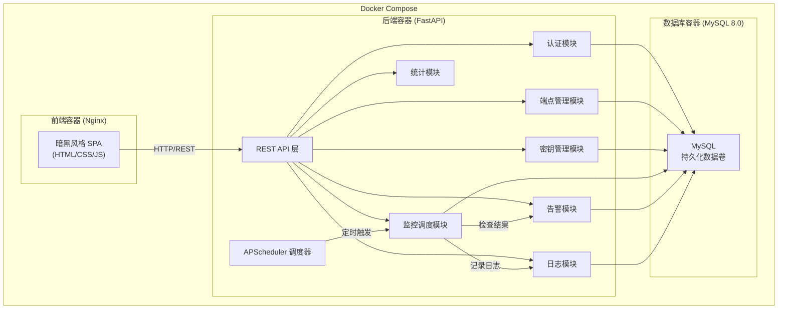
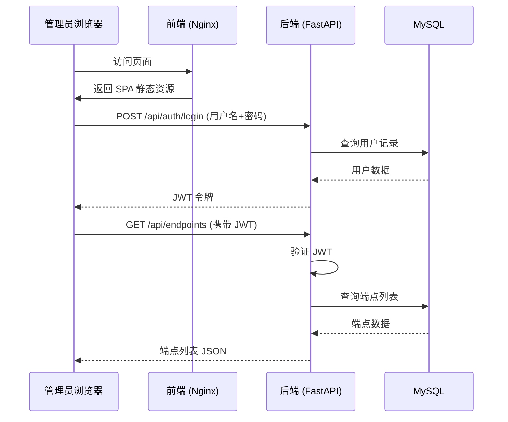
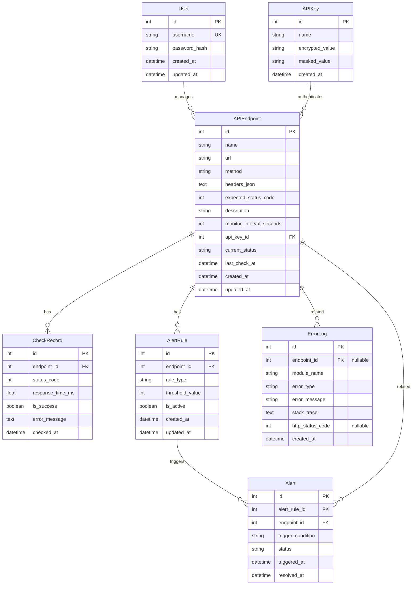

# 技术设计文档：API 监控管理系统

## 概述

API 监控管理系统是一个全栈 Web 应用，用于集中管理和监控多个 API 端点的健康状态。系统采用前后端分离架构：

- **后端**：FastAPI（Python）提供 RESTful API，负责认证、端点管理、监控调度、告警和日志等核心业务逻辑
- **数据库**：MySQL 8.0 存储所有业务数据
- **前端**：暗黑风格单页应用（SPA），通过 REST API 与后端交互
- **部署**：docker-compose 编排所有服务容器

系统面向管理员用户，支持 API 端点的 CRUD 管理、密钥管理、可配置频率的健康检查、实时状态展示、历史记录查询与导出、响应时间统计、告警规则配置与通知、错误日志查询等功能。

## 架构

### 整体架构图



### 技术选型

| 层级 | 技术 | 说明 |
|------|------|------|
| 后端框架 | FastAPI 0.100+ | 异步 Web 框架，自带 OpenAPI 文档 |
| ORM | SQLAlchemy 2.0 + Alembic | 数据库模型与迁移管理 |
| 任务调度 | APScheduler | 后台定时执行健康检查 |
| HTTP 客户端 | httpx | 异步 HTTP 请求，用于健康检查 |
| 认证 | python-jose (JWT) + passlib (bcrypt) | JWT 令牌签发与密码哈希 |
| 加密 | cryptography (Fernet) | API 密钥对称加密存储 |
| 数据库 | MySQL 8.0 | 关系型数据存储 |
| 前端 | 原生 HTML/CSS/JavaScript | 暗黑风格 SPA，无框架依赖 |
| 图表 | Chart.js | 响应时间趋势图和分布直方图 |
| 容器化 | Docker + docker-compose | 服务编排与部署 |

### 请求流程



## 组件与接口

### 后端 API 路由设计

#### 认证模块 (`/api/auth`)

| 方法 | 路径 | 说明 | 认证 |
|------|------|------|------|
| POST | `/api/auth/login` | 用户登录，返回 JWT | 否 |
| GET | `/api/auth/me` | 获取当前用户信息 | 是 |

#### 端点管理模块 (`/api/endpoints`)

| 方法 | 路径 | 说明 | 认证 |
|------|------|------|------|
| GET | `/api/endpoints` | 获取所有端点列表 | 是 |
| POST | `/api/endpoints` | 创建新端点 | 是 |
| GET | `/api/endpoints/{id}` | 获取单个端点详情 | 是 |
| PUT | `/api/endpoints/{id}` | 更新端点配置 | 是 |
| DELETE | `/api/endpoints/{id}` | 删除端点 | 是 |

#### 密钥管理模块 (`/api/keys`)

| 方法 | 路径 | 说明 | 认证 |
|------|------|------|------|
| GET | `/api/keys` | 获取所有密钥列表（脱敏） | 是 |
| POST | `/api/keys` | 创建新密钥 | 是 |
| DELETE | `/api/keys/{id}` | 删除密钥 | 是 |

#### 监控模块 (`/api/monitor`)

| 方法 | 路径 | 说明 | 认证 |
|------|------|------|------|
| GET | `/api/monitor/status` | 获取所有端点当前状态 | 是 |
| GET | `/api/monitor/status/{endpoint_id}` | 获取单个端点状态 | 是 |
| GET | `/api/monitor/health-rate` | 获取整体健康率 | 是 |

#### 历史记录模块 (`/api/records`)

| 方法 | 路径 | 说明 | 认证 |
|------|------|------|------|
| GET | `/api/records` | 查询检查记录（支持筛选） | 是 |
| GET | `/api/records/export` | 导出 CSV | 是 |

#### 统计模块 (`/api/stats`)

| 方法 | 路径 | 说明 | 认证 |
|------|------|------|------|
| GET | `/api/stats/{endpoint_id}` | 获取响应时间统计 | 是 |
| GET | `/api/stats/{endpoint_id}/histogram` | 获取响应时间分布数据 | 是 |

#### 告警模块 (`/api/alerts`)

| 方法 | 路径 | 说明 | 认证 |
|------|------|------|------|
| GET | `/api/alerts/rules` | 获取告警规则列表 | 是 |
| POST | `/api/alerts/rules` | 创建告警规则 | 是 |
| PUT | `/api/alerts/rules/{id}` | 更新告警规则 | 是 |
| DELETE | `/api/alerts/rules/{id}` | 删除告警规则 | 是 |
| GET | `/api/alerts` | 获取告警记录列表 | 是 |
| PUT | `/api/alerts/{id}/status` | 更新告警状态 | 是 |

#### 日志模块 (`/api/logs`)

| 方法 | 路径 | 说明 | 认证 |
|------|------|------|------|
| GET | `/api/logs` | 查询错误日志（支持筛选和分页） | 是 |

### 核心服务组件

#### MonitorScheduler（监控调度器）

负责管理所有 API 端点的定时健康检查任务。

```python
class MonitorScheduler:
    def start(self) -> None:
        """启动调度器，为所有活跃端点创建检查任务"""

    def stop(self) -> None:
        """停止调度器"""

    def add_endpoint(self, endpoint_id: int, interval_seconds: int) -> None:
        """为端点添加定时检查任务"""

    def remove_endpoint(self, endpoint_id: int) -> None:
        """移除端点的检查任务"""

    def update_interval(self, endpoint_id: int, interval_seconds: int) -> None:
        """更新端点的检查间隔"""
```

#### HealthChecker（健康检查器）

执行单次 API 健康检查并记录结果。

```python
class HealthChecker:
    async def check(self, endpoint: APIEndpoint) -> CheckRecord:
        """对指定端点执行一次健康检查，返回检查记录"""

    async def check_with_key(self, endpoint: APIEndpoint, api_key: str) -> CheckRecord:
        """携带 API 密钥执行健康检查"""
```

#### AlertEvaluator（告警评估器）

根据告警规则评估检查结果，决定是否触发告警。

```python
class AlertEvaluator:
    def evaluate(self, endpoint_id: int, check_record: CheckRecord) -> Optional[Alert]:
        """评估检查结果是否触发告警规则，返回告警记录或 None"""
```

#### KeyEncryptor（密钥加密器）

负责 API 密钥的加密和解密。

```python
class KeyEncryptor:
    def encrypt(self, plain_key: str) -> str:
        """加密 API 密钥"""

    def decrypt(self, encrypted_key: str) -> str:
        """解密 API 密钥"""

    @staticmethod
    def mask(plain_key: str) -> str:
        """脱敏显示，仅保留前四位和后四位"""
```

#### DataCleaner（数据清理器）

定时清理过期数据。

```python
class DataCleaner:
    async def clean_old_records(self, retention_days: int = 90) -> int:
        """清理超过保留期的检查记录，返回清理数量"""

    async def clean_old_logs(self, retention_days: int = 90) -> int:
        """清理超过保留期的错误日志，返回清理数量"""
```

### 前端页面结构

| 页面 | 路由 | 说明 |
|------|------|------|
| 登录页 | `/login` | 用户名密码登录表单 |
| 仪表盘 | `/` | 实时状态概览，健康率统计 |
| 端点管理 | `/endpoints` | API 端点 CRUD |
| 密钥管理 | `/keys` | API 密钥管理 |
| 历史记录 | `/records` | 检查记录查询与导出 |
| 统计分析 | `/stats` | 响应时间统计与图表 |
| 告警管理 | `/alerts` | 告警规则配置与告警记录 |
| 错误日志 | `/logs` | 错误日志查询 |


## 数据模型

### ER 关系图



### 数据表详细设计

#### users 表

| 字段 | 类型 | 约束 | 说明 |
|------|------|------|------|
| id | INT | PK, AUTO_INCREMENT | 主键 |
| username | VARCHAR(50) | UNIQUE, NOT NULL | 用户名 |
| password_hash | VARCHAR(255) | NOT NULL | bcrypt 哈希密码 |
| created_at | DATETIME | NOT NULL, DEFAULT NOW | 创建时间 |
| updated_at | DATETIME | NOT NULL, ON UPDATE NOW | 更新时间 |

#### api_endpoints 表

| 字段 | 类型 | 约束 | 说明 |
|------|------|------|------|
| id | INT | PK, AUTO_INCREMENT | 主键 |
| name | VARCHAR(100) | NOT NULL | 端点名称 |
| url | VARCHAR(500) | NOT NULL | 端点 URL |
| method | VARCHAR(10) | NOT NULL, DEFAULT 'GET' | HTTP 方法 |
| headers_json | TEXT | NULLABLE | 请求头 JSON |
| expected_status_code | INT | NOT NULL, DEFAULT 200 | 期望状态码 |
| description | VARCHAR(500) | NULLABLE | 描述 |
| monitor_interval_seconds | INT | NOT NULL, DEFAULT 300 | 监控间隔（秒） |
| api_key_id | INT | FK, NULLABLE | 关联的 API 密钥 |
| current_status | VARCHAR(20) | NOT NULL, DEFAULT 'unknown' | 当前状态：normal/abnormal/unknown |
| last_check_at | DATETIME | NULLABLE | 最近检查时间 |
| created_at | DATETIME | NOT NULL | 创建时间 |
| updated_at | DATETIME | NOT NULL | 更新时间 |

#### api_keys 表

| 字段 | 类型 | 约束 | 说明 |
|------|------|------|------|
| id | INT | PK, AUTO_INCREMENT | 主键 |
| name | VARCHAR(100) | NOT NULL | 密钥名称 |
| encrypted_value | TEXT | NOT NULL | Fernet 加密后的密钥值 |
| masked_value | VARCHAR(20) | NOT NULL | 脱敏显示值 |
| created_at | DATETIME | NOT NULL | 创建时间 |

#### check_records 表

| 字段 | 类型 | 约束 | 说明 |
|------|------|------|------|
| id | BIGINT | PK, AUTO_INCREMENT | 主键 |
| endpoint_id | INT | FK, NOT NULL, INDEX | 关联端点 |
| status_code | INT | NULLABLE | HTTP 响应状态码 |
| response_time_ms | FLOAT | NULLABLE | 响应时间（毫秒） |
| is_success | BOOLEAN | NOT NULL | 是否成功 |
| error_message | TEXT | NULLABLE | 错误信息 |
| checked_at | DATETIME | NOT NULL, INDEX | 检查时间 |

索引：`idx_endpoint_checked (endpoint_id, checked_at)` 用于历史记录查询和统计

#### alert_rules 表

| 字段 | 类型 | 约束 | 说明 |
|------|------|------|------|
| id | INT | PK, AUTO_INCREMENT | 主键 |
| endpoint_id | INT | FK, NOT NULL | 关联端点 |
| rule_type | VARCHAR(30) | NOT NULL | 规则类型：consecutive_failures / response_time |
| threshold_value | INT | NOT NULL | 阈值（失败次数或毫秒数） |
| is_active | BOOLEAN | NOT NULL, DEFAULT TRUE | 是否启用 |
| created_at | DATETIME | NOT NULL | 创建时间 |
| updated_at | DATETIME | NOT NULL | 更新时间 |

#### alerts 表

| 字段 | 类型 | 约束 | 说明 |
|------|------|------|------|
| id | INT | PK, AUTO_INCREMENT | 主键 |
| alert_rule_id | INT | FK, NOT NULL | 关联告警规则 |
| endpoint_id | INT | FK, NOT NULL, INDEX | 关联端点 |
| trigger_condition | VARCHAR(200) | NOT NULL | 触发条件描述 |
| status | VARCHAR(20) | NOT NULL, DEFAULT 'open' | 状态：open/acknowledged/resolved |
| triggered_at | DATETIME | NOT NULL | 触发时间 |
| resolved_at | DATETIME | NULLABLE | 解决时间 |

#### error_logs 表

| 字段 | 类型 | 约束 | 说明 |
|------|------|------|------|
| id | BIGINT | PK, AUTO_INCREMENT | 主键 |
| endpoint_id | INT | FK, NULLABLE, INDEX | 关联端点（系统错误时为空） |
| module_name | VARCHAR(50) | NOT NULL | 模块名称 |
| error_type | VARCHAR(100) | NOT NULL, INDEX | 错误类型 |
| error_message | TEXT | NOT NULL | 错误消息 |
| stack_trace | TEXT | NULLABLE | 堆栈信息 |
| http_status_code | INT | NULLABLE | HTTP 状态码 |
| created_at | DATETIME | NOT NULL, INDEX | 创建时间 |

索引：`idx_logs_filter (created_at, error_type, endpoint_id)` 用于日志筛选查询
